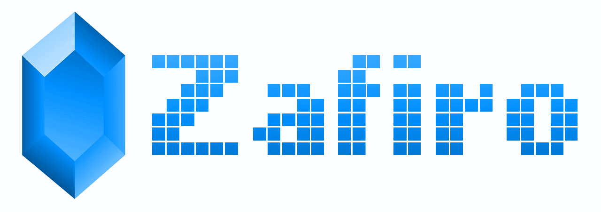

[](http://badge.fury.io/js/zafiro)
[](https://travis-ci.org/remojansen/zafiro)
[](https://ci.appveyor.com/project/remojansen/zafiro)
[](https://codeclimate.com/github/remojansen/zafiro/coverage)
[](https://david-dm.org/remojansen/zafiro#info=dependencies)
[](https://david-dm.org/remojansen/zafiro/#info=devDependencies)
[](https://david-dm.org/remojansen/zafiro/#info=peerDependenciess)
[](https://snyk.io/test/github/remojansen/zafiro)

[](https://nodei.co/npm/zafiro/)
[](https://nodei.co/npm/zafiro/)

:warning: :construction: WORK IN PROGRESS :construction: :warning:

I'm working on this project as a learning exercise.
Please don't expect it to become a real thing...

# Strongly typed algebraic data types

## Nothing
The type `Nothing` represents the absence of some type.

```ts
let nothing = new Nothing();
console.log(nothing.isNothing); // true
```

## Just<T>
The Just type represents the existence of some type.

```ts
let justANumber = new Just<number>(5);
console.log(justANumber.value); // 5
```

## Maybe<T>
The Maybe type represents the possibility of some value or
nothing. It is often used where null traditionally would to
represent the absence of a value. The advantage of using a
Maybe type over null is that it is both composable and
requires the developer to explicitly acknowledge the
potential absence of a value, helping to avoid the
existence of null pointer exceptions.

```ts
import { interfaces, filter, Either } from "zafiro";

interface User {
    city: string;
    name: string;
}

type callback = (response: interfaces.Maybe<User[]>) => void

function fetchUsers(cb: callback) {
    $.ajax({
        type: "GET",
        url: "/get/users/",
        success: (data: User[]) => {
            callback(
                new Maybe<User[]>(data); // just!
            );
        },
        error: function(jqXHR, textStatus, errorThrown) => {
            callback(
                new Maybe<User[]>(); // nothing!
            );
        }
    });
}

let isFrom = (city: string) => (user: User): boolean => user.city === city;
let isDubliner = isFrom("Dublin");
let filterByDubliners = filter<User>(isDubliner);

fetchUsers((maybeUsers) => {
    let dubliners = errorOrUsers.isJust ? filterByDubliners(maybeUsers.just.value) : [];
    console.log(dubliners);
});
```

## Either<TLeft, TRight>
Either is a representation of two possible types of values, 
sometimes referred to as the disjoint union, or coproduct of 
two types.

The Either type is very similar to the Maybe type, in that
it is often used to represent the notion of failure in some
way.

```ts
import { interfaces, filter, Either } from "zafiro";

interface User {
    city: string;
    name: string;
}

type callback = (response: interfaces.Either<Error, User[]>) => void

function fetchUsers(cb: callback) {
    $.ajax({
        type: "GET",
        url: "/get/users/",
        success: (data: User[]) => {
            callback(
                Either.Right<Error, User[]>(data) // right!
            );
        },
        error: (jqXHR, textStatus, errorThrown) => {
            callback(
                Either.Left<Error, User[]>(new Error(errorThrown)) // left!
            );
        }
    });
}

let isFrom = (city: string) => (user: User): boolean => user.city === city;
let isDubliner = isFrom("Dublin");
let filterByDubliners = filter<User>(isDubliner);

fetchUsers((errorOrUsers) => {
    let dubliners = errorOrUsers.isRight ? filterByDubliners(errorOrUsers.getRight()) : [];
    console.log(dubliners);
});
```

# Acknowledgements
This project would not be possible without the amazing work
acomplished by the following OSS projects:

- https://github.com/fantasyland/fantasy-land
- https://github.com/ramda/ramda
- https://github.com/ramda/ramda-fantasy