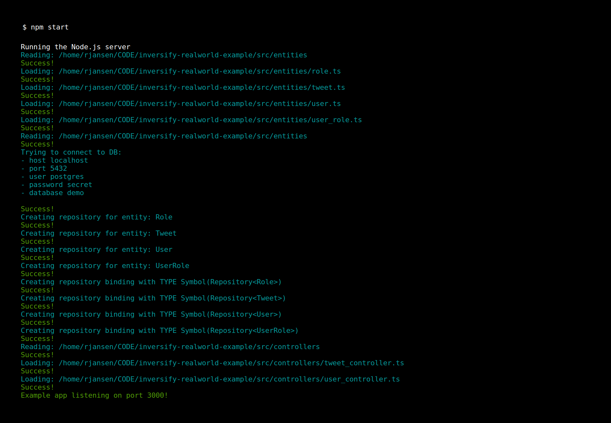

## :gem: Zafiro is a strongly typed and lightweight web framework for Node.js apps powered by [TypeScript](), [InversifyJS](https://github.com/inversify/InversifyJS), [TypeORM](https://github.com/typeorm/typeorm) and [Express](https://github.com/expressjs/express) :rocket:

[](https://gitter.im/inversify/InversifyJS?utm_source=badge&utm_medium=badge&utm_campaign=pr-badge&utm_content=badge)
[](http://badge.fury.io/js/zafiro)
[](https://travis-ci.org/remojansen/zafiro)
[](https://ci.appveyor.com/project/remojansen/zafiro)
[](https://david-dm.org/remojansen/zafiro#info=dependencies)
[](https://david-dm.org/remojansen/zafiro/#info=devDependencies)
[](https://snyk.io/test/github/remojansen/zafiro)
[](https://twitter.com/inversifyjs)

:warning: :construction: This library is under construction :construction: :warning:

## The Basics

Zafiro exposes a function named `createApp` that allows you to bootstrap an Express application in just a few minutes.

The application entry point look as follows:

```ts
import "reflect-metadata";
import { createApp } from "zafiro";
import { appBindings } from "./config/ioc_config";
import { expressConfig } from "./config/express_config";
import { CustomAccountRepository } from "./repositories/account_repository";

(async () => {

    try {
        const app = await createApp({
            database: "postgres",
            containerModules: [appBindings],
            expressConfig: expressConfig,
            AccountRepository: CustomAccountRepository
        });

        app.listen(
            3000,
            () => console.log(
                chalk.green("Example app listening on port 3000!")
            )
        );

    } catch (e) {
        console.log(chalk.redBright(e.message));
    }

})();
```

The `createApp` function takes a configuration object that can be used to configure your application:

- The `database` property allows you to select the database server to be used. Please refer to TypeORM to learn more about the supported databases.
- The `containerModules` **[Optional]** property allows you to declare the dependency injection bindings using an array of InversifyJS `ContainerModule`.
- The `dir` **[Optional]** property allows you to customize the root directory of your application. This directory is expected to contain the `controllers` and `entities` directories.
- The `container` **[Optional]** property allows you to provide a custom InversifyJS `Container` instance.
- The `customRouter` **[Optional]** property allows you to provide a custom Express `Router` instance.
- The `routingConfig` **[Optional]** property allows you to provide a custom inversify-express-utils `RoutingConfig`.
- The `customApp` **[Optional]** property allows you to provide a custom Express application instance.
- The `AccountRepository` **[Optional]** property allows you to provide a custom `AccountRepository`.
- The `expressConfig` **[Optional]** property is a function `(app: express.Application) => void` that can be used to set some Express config.

### Required Environment Variables

A Zafiro application expects the following environment variables to be available:

- The `DATABASE_HOST` variable should contain the network address of your database.
- The `DATABASE_PORT` variable should contain the network port of your database.
- The `DATABASE_USER` variable should contain the user name of your database.
- The `DATABASE_PASSWORD` variable should contain the user password of your database.
- The `DATABASE_DB`variable should contain the name of your database.

### Required Project Folders

A Zafiro application expects the following directory structure and convention:

- `/src/controllers/` You must add your controllers unders this folder. The controllers are powerd by [inversify-express-utils](https://github.com/inversify/inversify-express-utils).

- `/src/entities/` You must add your entities unders this folder. The entities are powerd by [TypeORM](https://github.com/typeorm/typeorm).

> :warning: Please note that each entity and each controller in your application must be defined on its own file and be exported using a [`default` ES6 export](https://developer.mozilla.org/en-US/docs/Web/JavaScript/Reference/Statements/export#Using_the_default_export).

### Defining an Entity

You can define an entity as follows:

```ts
import { Entity, Column, PrimaryGeneratedColumn } from "typeorm";

@Entity()
export default class DirectMessage {

    @PrimaryGeneratedColumn()
    id: number;

    @Column()
    senderId: number;

    @Column()
    recipientId: number;

    @Column()
    content: string;

    @CreateDateColumn()
    createdDate: Date;
}
```

The Entity API is powered by [TypeORM API](https://github.com/typeorm/typeorm#create-an-entity):

### Declaring a Repository<T>

A `Repository<T>` will be generated automatically at runtime. The [repository API](https://github.com/typeorm/typeorm#loading-from-the-database) is powered by TypeORM.

You can access a `Repository<T>` by injection it into a `Controller`, `BaseMiddleware`, `AuthProvider`, etc. First you need to declare a type identifier for the repository that you wish to inject:

```ts
const TYPE = {
    DirectMessageRepository: Symbol.for("Repository<DirectMessage>")
};
```

Then you can inject it using the `@inject` annotation:

```t
@inject(TYPE.DirectMessageRepository) private readonly _dmRepository: Repository<DirectMessage>;
```

The Dependency Injection API in Zafiro is powered by [InversifyJS](https://github.com/inversify/InversifyJS).

The Repository API is powered by [TypeORM API](https://github.com/typeorm/typeorm#create-an-entity):

### Declaring a Controller

You can declare a controller as follows:

```ts
import { injectable, inject } from "inversify";
import { controller, httpGet, BaseHttpController } from "inversify-express-utils";
import { TYPE } from "./contants/types";

@controller("/direct_message")
class UserPreferencesController extends BaseHttpController {

    @inject(TYPE.DirectMessageRepository) private readonly _dmRepository: Repository<DirectMessage>;

    @httpGet("/")
    public async get() {
        if (!this.httpContext.user.isAuthenticated()) {
            this.httpContext.res.status(403).send("Forbidden");
        } else {
            return await this._dmRepository.find({
                recipientId: this.httpContext.details.id;
            });
        }
    }

}
```

The Controllers API in Zafiro is powered by [inversify-express-utils](https://github.com/inversify/inversify-express-utils).

## Why Zafiro?

I created Zafiro because I love working with JavaScript and Node.js but I miss the boilerplate-automation and the type-safety productivity boost that I have experience while working with other technologies in the past.


Thanks to InversifyJS and TypeORM, Zafiro is able to automate a lot of the boilerplate required to create an Express application. As a first step, Zafiro is able to create a database connection, auto-generate the [data repositories](https://msdn.microsoft.com/en-us/library/ff649690.aspx) and inject them into your controllers:



Zafiro has been designed with the goal of providing a great developer experience.

I plan to continue working hard to: 

- Make Zafiro very robust.
- Reduce the amount of required boilerplate.
- Improve the developer experience.

## Example Application

An example application is available at [zafiro-realworld-example](https://github.com/remojansen/zafiro-realworld-example).
